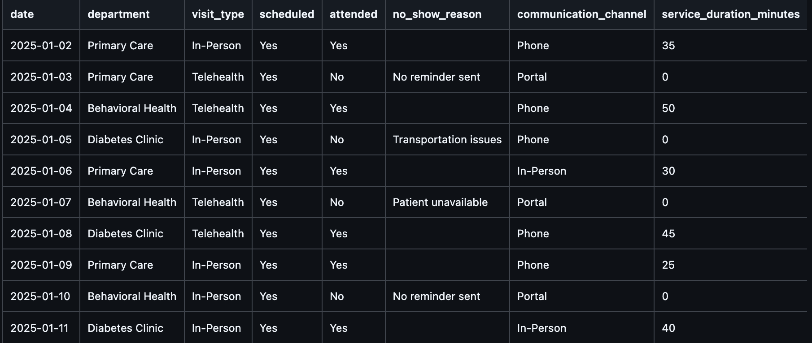

# Health Informatics Leadership Impact Dashboard  
**Using Operational Workflow Data to Inform Epic Optimization, Patient Safety, and Leadership Decision-Making**

## Project Overview  
This academic practicum project examines how informatics leadership can use
operational workflow data to improve patient engagement, reduce appointment
no-show rates, and support workflow optimization within a healthcare
organization. The project draws on observations from a leadership practicum
focused on Epic optimization governance, interdisciplinary oversight, and
patient safety.

## Practicum Context  
As part of my leadership practicum, I observed multiple leadership forums, including Epic Intake Oversight Council meetings, NOVA Honor Roll grant eligibility meetings, and hospital-wide safety huddles. These settings highlighted how leadership decisions related to Epic optimization directly impact safety readiness, clinician usability, and access to strategic funding opportunities.

## Leadership Question  
**How can informatics leadership improve Epic optimization governance to enhance patient safety, clinician usability, and organizational performance outcomes?**

## Data Description  
This project uses simulated, de-identified operational data over a three-month period. The dataset includes Epic optimization requests, safety-related workflow issues, leadership role assignment, and resolution outcomes.

## Technologies Used  
- Python  
- GitHub  
- AI-assisted analysis

## Screenshots
The image below shows a sample table from the operational workflow dataset used
in the Python-based analysis for this practicum project.

  

  ## Key Skills Demonstrated
- Health informatics leadership and governance
- Operational workflow and no-show analysis
- Data-driven decision-making
- Responsible application of AI in healthcare
- Translation of analytics into leadership action plans
- Professional portfolio development using GitHub

## How to View the Project
This repository represents an academic practicum project using simulated,
de-identified data and is not based on production healthcare systems.

Key files include:
- `README.md` – Project overview and context
- `/data` – Simulated operational workflow dataset and documentation
- `/notebooks/leadership_impact_analysis.md` – Analysis and leadership interpretation
- `/analysis/ai_insights.md` – AI-generated insights and leadership critique
- `LEADERSHIP_IMPACT_REPORT.md` – Final leadership impact report
> **Note:** This is an academic practicum project using simulated data and does not represent production hospital systems.
